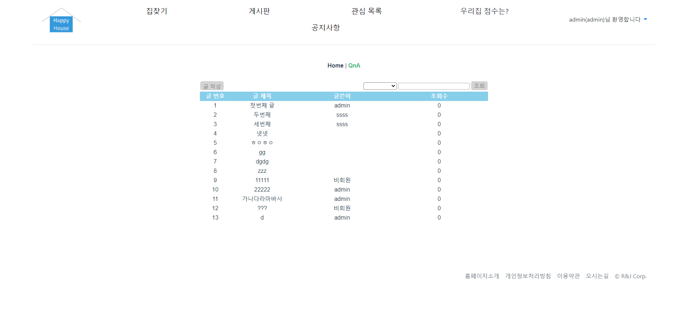

관통 프로젝트 제출 방법

# 관통프로젝트: HappyHouse_Vue_대전_03반_류건희_정혜지 
### 제출일: 2020.11.16일 23시 59분

### 참여 페어
- 류건희(조장), 정혜지

### 처리된 요구사항 목록 - Spring
  
|난이도|구현기능|세부|작성여부(O/X)|
|:---:|---|---|:---:|
|기본|메인페이지||O|
|기본|회원관리페이지|회원정보 등록화면|O|
|기본|회원관리페이지|회원정보 수정화면|O|
|기본|회원관리페이지|회원정보 삭제화면|X|
|기본|회원관리페이지|회원정보 검색화면|X|
|기본|로그인/로그아웃 페이지||O|
|기본|아파트 실거래가 검색,결과 페이지|전체검색화면|O|
|기본|아파트 실거래가 검색,결과 페이지|상세검색화면|X|
|기본|아파트 실거래가 검색,결과 페이지|동별화면|O|
|기본|아파트 실거래가 검색,결과 페이지|아파트별검색화면|O|
|추가||비밀번호찾기/사이트맵/메뉴구성|X|
|추가|관심지역 동네 업종 정보|코로나 진료소 검색, 안전병원 검색|O|
|추가|관심지역 대기 오염 정보||X|
|심화||웹사이트 소개|X|
|심화||공지사항|O|

### 처리된 요구사항 목록 - Vue
|난이도|구현기능|세부|작성여부(O/X)|
|:---:|---|---|:---:|
|기본|QnA 게시판 Vue|게시글 목록|O|
|기본|QnA 게시판 Vue|게시글 등록|O|
|기본|QnA 게시판 Vue|게시글 수정|O|
|기본|QnA 게시판 Vue|게시글상세 조회|O|
|기본|서버측 구현|게시글 등록|O|
|기본|서버측 구현|게시글 수정|O|
|기본|서버측 구현|게시글 삭제|O|
|기본|서버측 구현|게시글 상세조회|O|
|기본|서버측 구현|게시글 목록|O|
|추가|동네 업종 정보 조회||X|
|추가|동네 환경 점검 정보 조회||X|
|심화|메인 페이지 or 추가기능||X|

* 작성된 기능은 반드시 캡쳐되어야 합니다. 
* 추가로 구현한 기능을 표에 추가시키세요.

### 실행화면 캡쳐 - 
TODO: 요구사항 목록에서 완료 처리된 사항의 캡쳐 이미지를 등록하세요.

구현 기능: Spring (Controller, Model(Dao, Service, Dto)

구현 기능: 전체 프로그램 동작/오류 없이 전체 동작 1
## 메인화면

## 로그인화면

## 회원가입화면

## 로그인 성공 화면

## 매물 검색 화면

## 진료소 검색 화면

## 게시판 화면

## 게시판 검색 화면

## 글 추가 화면

## 글 상세보기 화면

## 글 삭제 화면

## 글 수정 화면

## 공지사항 화면

